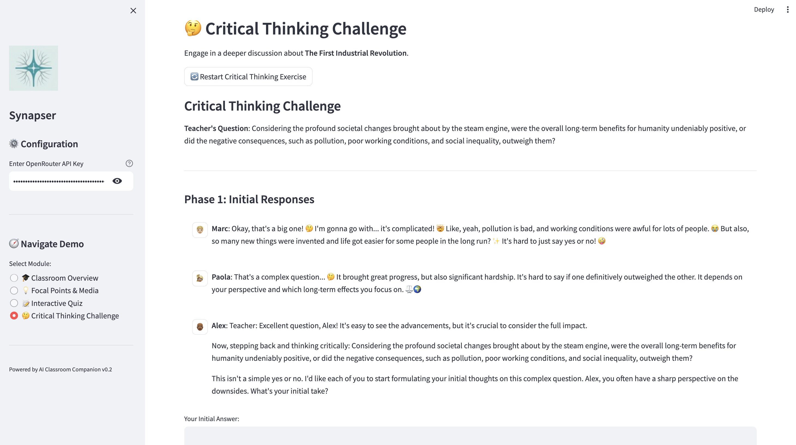

# ✨ Synapser: Your AI-Powered Study Group ✨

[](https://www.python.org/downloads/release/python-3120/)
[](https://opensource.org/licenses/MIT)

## 🎯 The Challenge

Studying alone can feel isolating, distracting, and unmotivating, especially for students aged 14-24. Passive learning often leads to frustration and giving up. 

Synapser tackles this by transforming solo study time into a **focused, guided, and interactive peer-driven group experience.**  We aim for better study sessions, leading to better outcomes! 

---

## 💡 Our Solution: Synapser

Synapser creates a virtual classroom powered by AI. Interact with AI classmates and a guiding AI teacher to make learning dynamic and engaging.

  
*(Agent Architecture Diagram from Technical Write-Up)* 

### 🛠️ Tech Stack

* **Language:** Python 3.12
* **AI Models via OpenRouter:**
    * 🗣️ Text-to-Text: `gemini-2.5-flash`
    * 🖼️ Text-to-Image: `flux-dev-lora`
    * 🎬 Image-to-Video: `wan-2.1-i2v-480p`
* **Core:** Custom Python Agent System (Task Management, Communication, Orchestration) 
* **UI:** Streamlit 

### 🚀 Key Features

* **Interactive Lessons:** Structured content with rich media (images/videos). 
* **AI Study Buddies:** Engage with AI agents possessing unique personalities for diverse discussions and quizzes. 
* **Critical Thinking Challenges:** Go beyond memorization with thought-provoking group discussions.
* *(Planned)* User Profiling & Adaptive Learning [cite: 5, 8]
* *(Planned)* Learning Management Tools (Calendar, Progress Tracking) 

### 🖼️ Sneak Peek

*(Based on provided screenshots)*

| Classroom Overview                                     | Focal Points & Media                                  | Interactive Quiz                                       | Critical Thinking                                        |
| :----------------------------------------------------- | :---------------------------------------------------- | :----------------------------------------------------- | :------------------------------------------------------- |
|  |          |       |        |
| *Meet your AI classmates!* | *Visual aids enhance learning.* | *Test your knowledge.* | *Engage in deeper discussions.* |

### 🚧 Current Limitations

* Scalability: Limited; no cloud deployment currently. 
* UI: Functional but basic responsiveness. 
* Interaction: Text-only input for now. 

---

## ⚙️ Get Started: Setup & Execution

Here's how to get Synapser running on your local machine:

1.  **Clone the Repository:**
    * This command downloads a copy of the project's code from GitHub to your computer.
        ```bash
        git clone [https://github.com/ghidav/GDGHack.git](https://github.com/ghidav/GDGHack.git)
        ```
    * Navigate into the newly created project folder:
        ```bash
        cd GDGHack
        ```

2.  **Set up a Virtual Environment:**
    * This creates an isolated space for the project's Python packages.
        ```bash
        # Create the environment
        python3 -m venv venv
        # Activate it (Linux/macOS)
        source venv/bin/activate
        # Activate it (Windows)
        .\venv\Scripts\activate
        ```

3.  **Install Dependencies:**
    * This installs all the necessary libraries listed in `requirements.txt`. 
        ```bash
        pip install -r requirements.txt
        ```

4.  **Configure API Key:**
    * Create a file named `.env` in the main `GDGHack` folder.
    * Add your OpenRouter API key to this file like so: 
        ```plaintext
        OPENROUTER_API_KEY="your_openrouter_api_key_here"
        ```
        *(Replace `"your_openrouter_api_key_here"` with your actual key from OpenRouter.ai)*

5.  **Run the Application:**
    * Make sure your virtual environment (`venv`) is still active.
    * Execute the following command in your terminal: 
        ```bash
        streamlit run synapser/app.py
        ```
    * This should automatically open Synapser in your web browser! 

---

## 🔮 Future Enhancements

We're excited about evolving Synapser! Here's what's on the horizon:

* 🎭 Emotionally expressive AI models. 
* ❤️ Real-time emotional adaptation (GDPR compliant). 
* 🏆 Weekly challenges with AI peers. 
* 🧑‍🏫 Teacher dashboard for monitoring progress. 
* 🗣️ Voice interaction capabilities.

---

## 🤝 Contributors

* Luca Anzaldi
* Marco Ferrari
* David Ghiraldi
* Dishank Gandhi

---